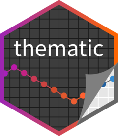
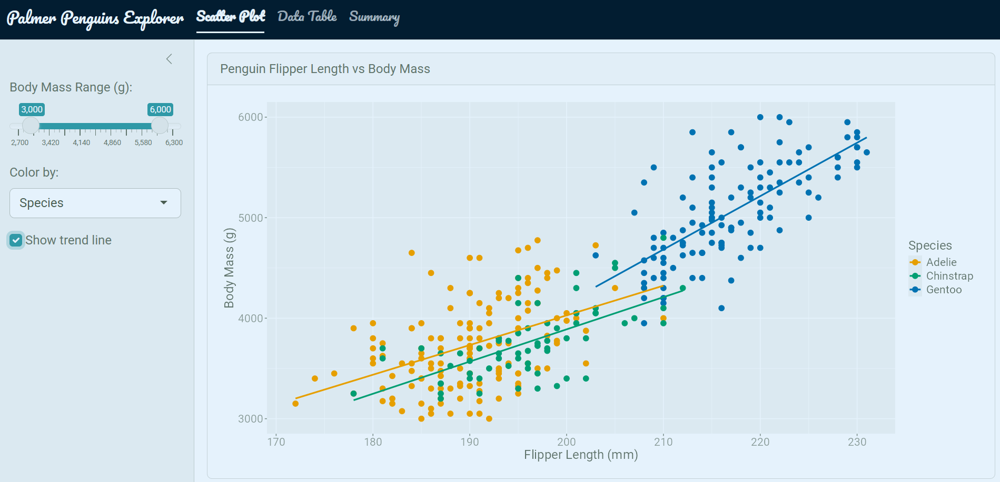
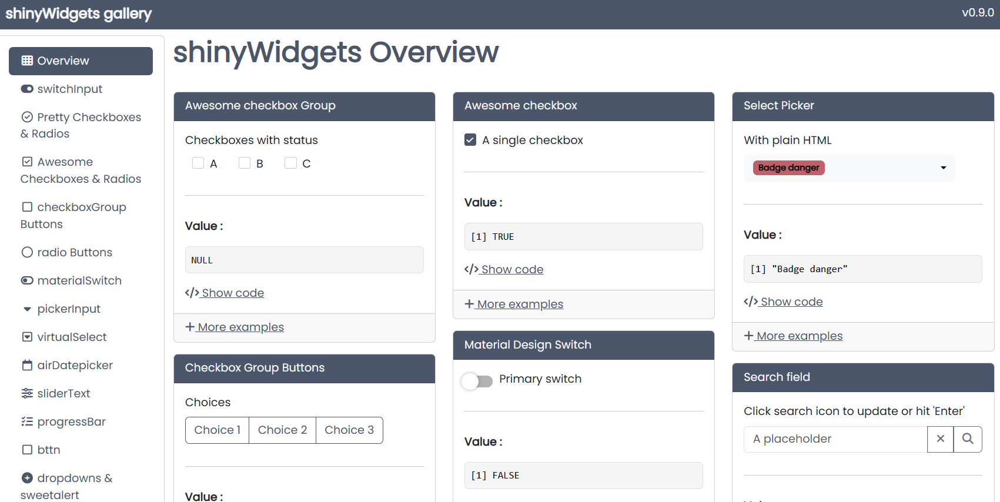

Shiny Apps are becoming increasingly popular for R and Python users alike. They serve as powerful tools for data visualization and interactive analysis using open-source tools. However, the default styling can feel, well, a bit *boring* out of the box. 

This is Part 1 of a two-part series on how to make your Shiny apps look polished and customized. Here in Part 1, I  will cover a few of the packages that streamline the theming process. [Part 2](../shiny_aesthetics_css/) covers custom HTML and CSS for fine-tuning specific elements.

You can find the full code for the example shiny apps used in this blog on my GitHub:

[ ramhunte/shiny-aesthetics](https://github.com/ramhunte/shiny-aesthetics)

---

## Default Shiny

Out of the box, Shiny uses **Bootstrap 3**, a popular - yet outdated - CSS framework used to style web applications. Essentially, it provides a set of pre-built styles and components for building web apps (not just in Shiny). 


Here is a very simple Shiny App I built using the `{palmerpenguins}` package dataset with the default layout functions and no custom styling:

{.round fig-align="center"}

This is built with the classic layout functions: `navbarPage()`, `tabPanel()`, `sidebarLayout()`. There's nothing wrong with it, but there's a lot of room for improvement.

## Packages to the Rescue

### {bslib} — The Modern Solution


{fig-align="center" width=30%}


[`{bslib}`](https://rstudio.github.io/bslib/) updates Shiny to **Bootstrap 5** (a more modern version than Bootstrap 3), brings 20+ pre-built themes, and a smoother theming experience in my experience. It consolidates nearly all of your styling decisions in one place and overall allows for more flexibility in customizing your app's appearance.


#### Shiny vs. bslib Layout Functions

Fortunately, `{bslib}` uses the same strucutre as `{Shiny}`, but with updated function names. This makes transitioning to the package really smooth if you are already comfortable with Shiny's layout functions. 

| Shiny             | bslib                                 |
|-------------------|---------------------------------------|
| `fluidPage()`     | `page_fluid()`                        |
| `navbarPage()`    | `page_navbar()`                       |
| `tabPanel()`      | `nav_panel()`                         |
| `sidebarLayout()` | `page_sidebar()` / `layout_sidebar()` |

Here, I used the same code as the default Shiny app, but swapped out the layout functions for their bslib equivalents: 

{.round fig-align="center"}

You can see the differences in the fonts, spacing, and overall *feel* of the app. Most notably, it uses a card based layout with the main panel contained in a box (called a card) and the sidebar is also more comparmentalized. 

#### Adding a Pre-Built Theme

Maybe we want to add some theme to on top of this. Using the new functions from `{bslib}` doesn't automatically overhaul the appearance. 

The nice thing is that we can choose from over 20 pre-built [Bootswatch](https://bootswatch.com/) themes to be used in our app. we can easily add it with the `bs_theme(bootswatch = ...)` function:

```{r}
#| eval: false
#| filename: "ui.R"
ui <- page_navbar(
  title = "Palmer Penguins Explorer",

  theme = bslib::bs_theme(
    bootswatch = "minty"
  )
  # ... other UI code ...
)
```

{.round fig-align="center"}

#### Custom Theme on Top of `minty`

We can see some changes ot the fonts, colors, and general styling, but usually that's not enough. We can add in our own custom colors and fonts in as well.  

```{r}
#| eval: false
#| filename: "ui.R"
ui <- page_navbar(
  title = "Palmer Penguins Explorer",

  theme = bslib::bs_theme(
    bootswatch  = "minty",
    fg          = "#293f2fff",      # foreground color
    bg          = "#e5f2fcff",      # background color
    primary     = "#2f99a7ff",      # accent color
    base_font   = font_google("Roboto"),
    heading_font = font_google("Pacifico")
  ),

  navbar_options = bslib::navbar_options( # change the navigation bar background color
    bg = "#021d31ff"
  )
  # ... other UI code ...
)
```

{.round fig-align="center"}

It now looks quite a bit better! We have some custome colors and fonts in there, but you can also notice the `{ggplot}` chart is still using its default styling options. Maybe we want to make this match up with the theme of the app as well.  

### {thematic} — ggplot themeing 


{fig-align="center" width=30%}

Calling the `thematic::thematic_shiny()` function at the end of your server automatically adapts your `{ggplot2}` object theme to match whatever `{bslib}` theme is active. 


```{r}
#| eval: false
#| filename: "server.R"
server <- function(input, output) {
  # ... server code ...
  thematic::thematic_shiny(font = "auto")
  # ... other server code ...
}
```

{.round fig-align="center"}


## Icons, Value Boxes, and Widgets

We can alse add in some other elements to make our app feel more custom. I use icons, value boxes, and prettier widgets to do this. 

### Icons

The 2 main options I use for icons in Shiny apps are: 

- [`{bsicons}`](https://icons.getbootstrap.com/) — Bootstrap's icon library (works natively with `{bslib}`)
- `{fontawesome}` — more widely used icon library with more options

{fig-align="center" width="90%"}

### Value Boxes

I also really like using value boxes in my apps. Essentially they are card based elements that highlight a specific value or metric. They point out key information in a visually appealing way and give apps a dashboard feel. These are provided by the `{bslib}` package and can be easily added in anywhere you your app with the `value_box()` function.

```{r}
#| eval: false
#| filename: "ui.R"
value_box(
  value    = nrow(penguins),
  title    = "Total Penguins",
  showcase = bsicons::bs_icon("hash"), # insert an icon from the bsicons library
  theme    = "primary"
)
```

{.round fig-align="center"}

### {shinyWidgets} — Prettier Inputs

Another really great package for making your apps look more polished is `{shinyWidgets}`. This package offers a variety of input widgets that look much nicer than the default inputs. You can easily style and color them, and they automatically inherit the theming that you set up with `{bslib}`.

::: {.callout-note}
Run `shinyWidgets::shinyWidgetsGallery()` to browse all available widgets.
:::


{fig-align="center" width="90%"}

```{r}
#| eval: false
#| filename: "ui.R"
layout_sidebar(
  sidebar = sidebar(
    # ... other sidebar inputs ...
    shinyWidgets::pickerInput(
      inputId  = "species",
      label    = "Species",
      choices  = levels(penguins$species),
      multiple = TRUE
    )
  )
)
```

{.round fig-align="center"}

## Summary 

In summary, you can really elevate the look and feel of your Shiny apps with just a handful of packages. I just covered the main ones I routinely use along with their primary functions. This app wasn't designed to be a standout example app but rather just a simple one to demonstrate how we can effectively streamline our theming process. 

| Package        | Role                                      |
|----------------|-------------------------------------------|
| `shiny`        | App framework                             |
| `bslib`        | Modern Bootstrap 5 theming and layout     |
| `thematic`     | Auto-theme ggplot2 plots to match the app |
| `shinyWidgets` | Prettier input widgets                    |
| `bsicons`      | Bootstrap icon library                    |

### Part 2: Custom HTML and CSS

For fine-tuning specific elements beyond what these packages offer, see [Part 2: Custom HTML and CSS](../shiny_aesthetics_css/).