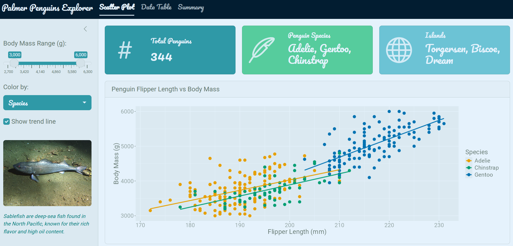
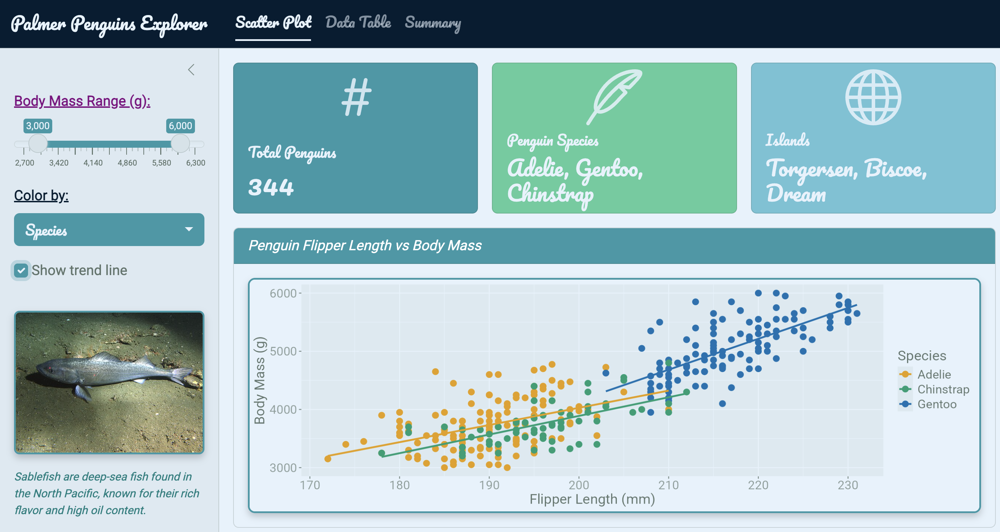

In [Part 1](../shiny_aesthetics/) we covered the R packages — `{bslib}`, `{thematic}`, `{shinyWidgets}`, and `{bsicons}` — that handle roughly 90% of Shiny app theming without writing any HTML or CSS. This post covers the other 10%: understanding the web design fundamentals that underpin Shiny, and using `{htmltools}` along with custom CSS to fine-tune what the packages can't reach.

The full code for the example app is on GitHub: [ ramhunte/shiny-aesthetics](https://github.com/ramhunte/shiny-aesthetics)

------------------------------------------------------------------------

## Web Design Basics

Every webpage — including every Shiny app — is built on three layers:

{fig-align="center" width="80%"}

**HTML** — the skeleton. Structures content using tags like `<div>`, `<p>`, `<h1>`, and ``.

**CSS** — the style. Controls colors, fonts, spacing, borders, and layout.

**JavaScript** — the interactivity. Makes things move and respond to user actions.

Shiny already wraps HTML, CSS, and JS for you, which is why you can build an app without knowing any of this. But understanding these layers is what unlocks the ability to customize beyond the defaults.

------------------------------------------------------------------------

## HTML Basics

HTML is made up of *tags* — containers that define the type of content they hold.

{fig-align="center" width="50%"}

Common tags you'll encounter in Shiny:

| Tag             | Purpose           |
|-----------------|-------------------|
| `<div>`         | Generic container |
| `<p>`           | Paragraph text    |
| `<h1>` – `<h6>` | Headings          |
| ``         | Image             |

Tags are nested to build structure. A simple styled box:

``` html
<div style="background: red; padding: 1rem; border-radius: 12px; width: 20%;">
  <div style="background: blue; padding: 6px 10px;">
    <p style="font-size: 20px; font-style: italic; text-decoration: underline;">
      HTML and CSS
    </p>
  </div>
</div>
```

:::: {style="background: red; padding: 1rem; border-radius: 12px; width: 20%;"}
::: {style="background: blue; padding: 6px 10px;"}
```         
<p style="font-size: 20px; font-style: italic; text-decoration: underline; background: transparent;">
  HTML and CSS
</p>
```
:::
::::

<br>

An image card with a caption:

``` html
<div style="border: 4px solid teal; border-radius: 12px; 
            padding: 1rem; width: 25%; margin: 0.5rem auto;">
  
  <p>Sablefish</p>
</div>
```

::: {style="border: 4px solid teal; border-radius: 12px; padding: 1rem; width: 25%; margin: 0.5rem auto;"}


<p style="margin: 0.5rem 0 0 0;">

Sablefish

</p>
:::

<br>

------------------------------------------------------------------------

## CSS Basics

CSS *properties* control specific aspects of the visual design:

| Property        | What it controls           |
|-----------------|----------------------------|
| `background`    | Background color or image  |
| `padding`       | Inner spacing              |
| `border-radius` | Rounded corners            |
| `font-size`     | Text size                  |
| `border`        | Border width, style, color |
| `box-shadow`    | Drop shadows               |
| `color`         | Text color                 |

{fig-align="center" width="70%"}

------------------------------------------------------------------------

## `{htmltools}` — Custom HTML in R

::::: columns
::: {.column width="30%"}
{fig-align="center"}
:::

::: {.column width="70%"}
`{htmltools}` lets you write HTML elements directly in R using the `tags$` family of functions. This is how you embed custom content inside a Shiny UI without leaving R.

Common tags:

- `tags$div()`
- `tags$p()`
- `tags$img()`
- `tags$h1()` – `tags$h6()`
- `tags$head()` / `tags$link()`
:::
:::::

### Example: Sablefish Sidebar Card

Adding an image with a styled caption to the app sidebar:

```{r}
#| eval: false
#| filename: "ui.R"
layout_sidebar(
  sidebar = sidebar(
    # ... other sidebar code ...

    htmltools::tags$img(
      src   = "sablefish.jpg",
      width = "100%",
      style = "margin-top: 1rem; border-radius: 6px;"
    ),

    htmltools::tags$p(
      "Sablefish are deep-sea fish found in the North Pacific,
       known for their rich flavor and high oil content.",
      style = "color: teal; font-size: 0.8rem; font-style: italic;"
    )
  )
)
```

{.round fig-align="center"}

The `style = "..."` argument is *inline CSS* — CSS written directly on a single element.

------------------------------------------------------------------------

## CSS Hierarchy

There are two main places to write CSS in a Shiny app, and they have a priority order:

1.  **Inline CSS** (highest priority) — `style = "..."` directly on a tag
2.  **External CSS file** (lower priority, but best practice for maintainability)

For small tweaks inline is fine. Once you're styling many elements consistently, an external file is much cleaner.

### Linking an External CSS File

Place your `styles.css` file in the `www/` folder of your Shiny app, then link it in the UI:

```{r}
#| eval: false
#| filename: "ui.R"
ui <- page_navbar(
  title = "Palmer Penguins Explorer",
  theme = bs_theme(
    # ... theme code ...
  ),

  tags$head(tags$link(
    rel  = "stylesheet",
    type = "text/css",
    href = "styles.css"   # file lives in www/styles.css
  ))
  # ... other UI code ...
)
```

Moving the inline style from above into the external file:

```{r}
#| eval: false
#| filename: "ui.R"
# Inline — before
htmltools::tags$img(
  src   = "sablefish.jpg",
  style = "margin-top: 1rem; border-radius: 6px;"
)

# Inline removed — CSS lives in the external file now
htmltools::tags$img(
  src = "sablefish.jpg"
)
```

``` css
/* styles.css — applies to all  elements */
img {
  margin-top: 1rem;
  border-radius: 6px;
}
```

------------------------------------------------------------------------

## CSS Selector Types

CSS targets elements using *selectors*. There are three main types:

| Selector | Syntax          | Targets                          |
|----------|-----------------|----------------------------------|
| HTML tag | `img { }`       | All `` elements             |
| Class    | `.my-class { }` | Elements with `class="my-class"` |
| ID       | `#my-id { }`    | Single element with `id="my-id"` |

The key to using class and ID selectors is knowing what names Shiny assigns to its components. Use your browser's **Inspect** tool (right-click → Inspect) to browse the live DOM and find the exact class and ID names:

{.round fig-align="center"}

### Putting It Together

``` css
/* styles.css */

/* Tag selector — targets all images */
img {
  border: #2f99a7ff solid 2px;
  border-radius: 8px;
  box-shadow: 0 4px 8px rgba(0, 0, 0, 0.2);
}

/* Class selector — targets Shiny input labels */
.control-label {
  font-weight: bold;
  color: #021d31ff;
  text-decoration: underline;
}

/* ID selector — targets a specific input label */
#mass_range-label {
  color: purple;
}

/* Class selector — targets bslib card headers */
.card-header {
  background-color: #2f99a7ff;
  color: white;
  font-style: italic;
}
```

{.round fig-align="center"}

------------------------------------------------------------------------

## The 90/10 Workflow

To summarize how packages and custom CSS fit together:

- **\~90%** — `{bslib}` + supporting packages
  - Theme, layout, icons, value boxes, pre-built widgets
  - Handles the broad visual identity of the app
- **\~10%** — `{htmltools}` + custom CSS
  - Fine-tuning individual elements
  - Targeting specific classes and IDs that bslib doesn't expose

Start with packages. Reach for HTML and CSS only when you need something more specific.

------------------------------------------------------------------------

## Summary

| Tool | Use for |
|-----------------------------|-------------------------------------------|
| `htmltools::tags$img()` etc. | Embedding custom HTML elements in the UI |
| Inline `style = "..."` | Quick one-off styles on a single element |
| External `styles.css` | Consistent styles applied across many elements |
| Tag selector | Style all elements of a given type |
| Class selector | Style a group of related elements |
| ID selector | Style one specific element |
| Browser Inspect tool | Find the class/ID names Shiny uses |